<div align="center">


# Aria Access

**AI-powered web accessibility scanner that finds what automated tools miss.**

[](https://github.com/supratimsarkar/aria-access/actions/workflows/ci.yml)
[](LICENSE)
[](https://nextjs.org)
[](https://typescriptlang.org)
[](https://openai.com)
[](https://www.w3.org/WAI/WCAG22/quickref/)

<br/>



<br/>

**[Live Demo](https://aria-access.vercel.app) · [Report a Bug](https://github.com/supratimsarkar/aria-access/issues/new?template=bug_report.md) · [Request a Feature](https://github.com/supratimsarkar/aria-access/issues/new?template=feature_request.md)**

</div>

---

## The Problem

**Over 96% of the top 1 million websites have detectable WCAG failures.** Automated tools like Lighthouse and axe-core catch only ~30–40% of real accessibility issues — the rest require human eyes or, now, AI vision.

Aria Access closes that gap.

---

## What Makes Aria Different

| Feature | Traditional Tools | Aria Access |
|---|---|---|
| Automated rule-based scan | ✅ | ✅ (axe-core) |
| AI Vision analysis | ❌ | ✅ (GPT-4o) |
| Contextual fix suggestions | ❌ | ✅ |
| WCAG 2.2 criteria mapping | Partial | ✅ Full |
| Severity triage | Basic | ✅ Critical → Minor |
| Scan-to-report in seconds | Varies | ✅ ~10s |
| No install required | ❌ | ✅ Pure SaaS |

---

## Key Features

- **Dual-engine scanning** — axe-core catches rule violations; GPT-4o Vision spots visual/contextual issues a rule engine never could (low contrast text in images, misleading link text, decorative elements mislabelled)
- **Accessibility score 0–100** with a breakdown by severity: Critical, Serious, Moderate, Minor
- **WCAG 2.2 criteria tags** on every issue so developers know exactly which success criterion is violated
- **Actionable fix suggestions** — not just "this is broken", but here's the code to fix it
- **Instant, no-install** — paste a URL and get results in ~10 seconds
- **Auth-gated deep scans** via Clerk — free demo on curated sites, full scans for signed-in users
- **Persistent scan history** with Neon Serverless Postgres + Drizzle ORM
- **Fully accessible UI** — Aria Access itself passes its own scanner

---

## Architecture

```
┌─────────────────────────────────────────────────────────────┐
│                     Next.js 16 App Router                    │
│                                                             │
│  Landing Page  ──►  /api/scan  ──►  Puppeteer (Chromium)   │
│                          │                                  │
│                    ┌─────┴──────┐                           │
│                    │            │                           │
│               axe-core     Screenshot                       │
│               (DOM audit)  (via page.screenshot)            │
│                    │            │                           │
│                    └──────┬─────┘                           │
│                           │                                 │
│                      GPT-4o Vision                          │
│                    (visual analysis)                        │
│                           │                                 │
│                    Merged ScanResult                        │
│                           │                                 │
│              Neon Postgres (scan history)                   │
└─────────────────────────────────────────────────────────────┘
```

**Stack:**
- **Framework:** Next.js 16 (App Router, Server Actions, Edge-ready)
- **Language:** TypeScript 5 (strict)
- **Styling:** Tailwind CSS 4 + shadcn/ui
- **Auth:** Clerk (JWT, social login, magic link)
- **Database:** Neon Serverless Postgres + Drizzle ORM
- **AI:** OpenAI GPT-4o Vision API
- **Scanning:** Puppeteer Core + @sparticuz/chromium (serverless-compatible)
- **Accessibility engine:** axe-core 4.12
- **Animation:** Motion (Framer Motion v12)
- **Deployment:** Vercel

---

## Getting Started

### Prerequisites

- Node.js 20+
- A [Clerk](https://clerk.com) account (free tier works)
- A [Neon](https://neon.tech) database (free tier works)
- An [OpenAI](https://platform.openai.com) API key with GPT-4o access

### 1. Clone & Install

```bash
git clone https://github.com/supratimsarkar/aria-access.git
cd aria-access
npm install
```

### 2. Configure Environment

```bash
cp .env.example .env.local
```

Open `.env.local` and fill in:

```env
# Clerk — https://dashboard.clerk.com
NEXT_PUBLIC_CLERK_PUBLISHABLE_KEY=pk_test_...
CLERK_SECRET_KEY=sk_test_...

# Neon — https://console.neon.tech
DATABASE_URL=postgresql://...

# OpenAI — https://platform.openai.com/api-keys
OPENAI_API_KEY=sk-...
```

### 3. Push Database Schema

```bash
npx drizzle-kit push
```

### 4. Run

```bash
npm run dev
```

Open [http://localhost:3000](http://localhost:3000) — paste any URL and hit **Scan**.

---

## Usage

### Free (no account)

Scan any of the curated demo sites (`github.com`, `stripe.com`, `amazon.com`) without signing in to see Aria in action.

### Full access (sign in)

Scan **any URL** on the internet. Your scan history is saved to your account.

### Reading your report

| Severity | Meaning |
|---|---|
| 🔴 Critical | Blocks access entirely for some users |
| 🟠 Serious | Severely degrades experience |
| 🟡 Moderate | Causes friction, workarounds exist |
| ⚪ Minor | Best-practice violation, low impact |

Each issue card shows:
- The failing element (DOM selector or screenshot region)
- The WCAG 2.2 criterion violated
- A plain-English description
- A concrete code fix

---

## Project Structure

```
aria-access/
├── app/
│   ├── api/
│   │   └── scan/          # POST /api/scan — the core scanning endpoint
│   ├── layout.tsx
│   └── page.tsx           # Landing page
├── components/
│   ├── landing/           # Hero, HowItWorks, ScanDemo, etc.
│   ├── scan-form.tsx      # URL input + scan trigger
│   ├── scan-results.tsx   # Score ring + issues list
│   ├── issue-card.tsx     # Individual accessibility issue
│   └── score-ring.tsx     # SVG score visualisation
├── db/
│   ├── index.ts           # Drizzle client (Neon serverless)
│   └── schema.ts          # Database schema
├── lib/
│   ├── types.ts           # ScanResult, Issue, Severity types
│   └── utils.ts           # cn() and helpers
└── public/
    └── demo.svg           # Animated product demo
```

---

## Roadmap

- [ ] **PDF / HTML report export** — downloadable audit reports for clients
- [ ] **CI/CD integration** — GitHub Action that fails the build on critical regressions
- [ ] **Scheduled monitoring** — weekly scans with email diff reports
- [ ] **Multi-page crawl** — scan entire site, not just one URL
- [ ] **Team workspaces** — share reports, assign issues, track remediation
- [ ] **Browser extension** — scan the page you're on with one click
- [ ] **WCAG 2.2 AA/AAA toggle** — choose your compliance target
- [ ] **Remediation tracking** — re-scan and see your score improve over time

---

## Contributing

Contributions are very welcome! See [CONTRIBUTING.md](CONTRIBUTING.md) for guidelines.

Found a bug? [Open an issue.](https://github.com/supratimsarkar/aria-access/issues/new?template=bug_report.md)
Have an idea? [Start a discussion.](https://github.com/supratimsarkar/aria-access/discussions)

---

## Security

If you discover a security vulnerability, please see [SECURITY.md](SECURITY.md) for responsible disclosure instructions. Do **not** open a public issue.

---

## License

[MIT](LICENSE) — free to use, modify, and distribute. Attribution appreciated.

---

## Why Accessibility Matters

> "The power of the Web is in its universality. Access by everyone regardless of disability is an essential aspect." — Tim Berners-Lee, W3C Director

An estimated **1.3 billion people** live with some form of disability. Web accessibility is not a niche compliance checkbox — it is the difference between a product that works for everyone and one that silently excludes hundreds of millions of people.

Aria Access makes it effortless to know where you stand and exactly what to fix.

---

<div align="center">

Built with care by [Supratim Sarkar](https://github.com/supratimsarkar)

**[Try it live →](https://aria-access.vercel.app)**

</div>
